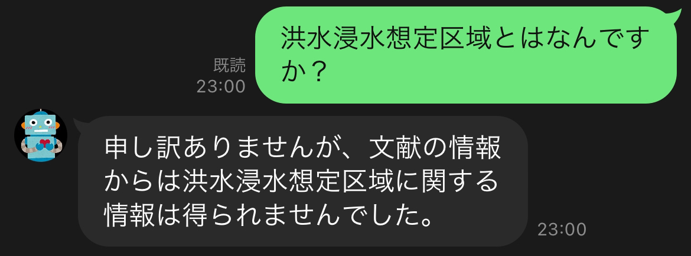
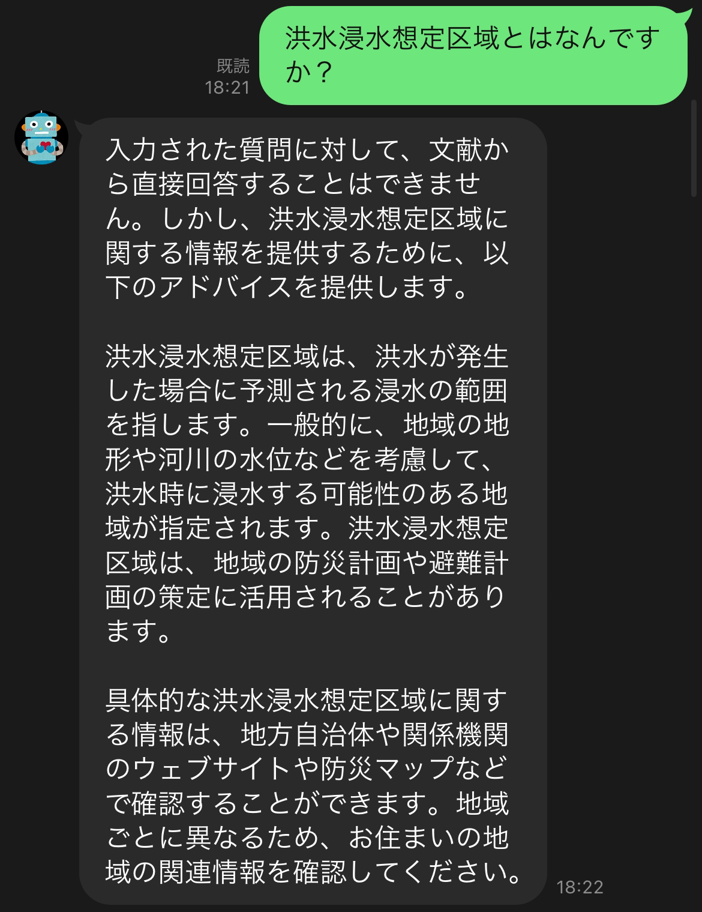
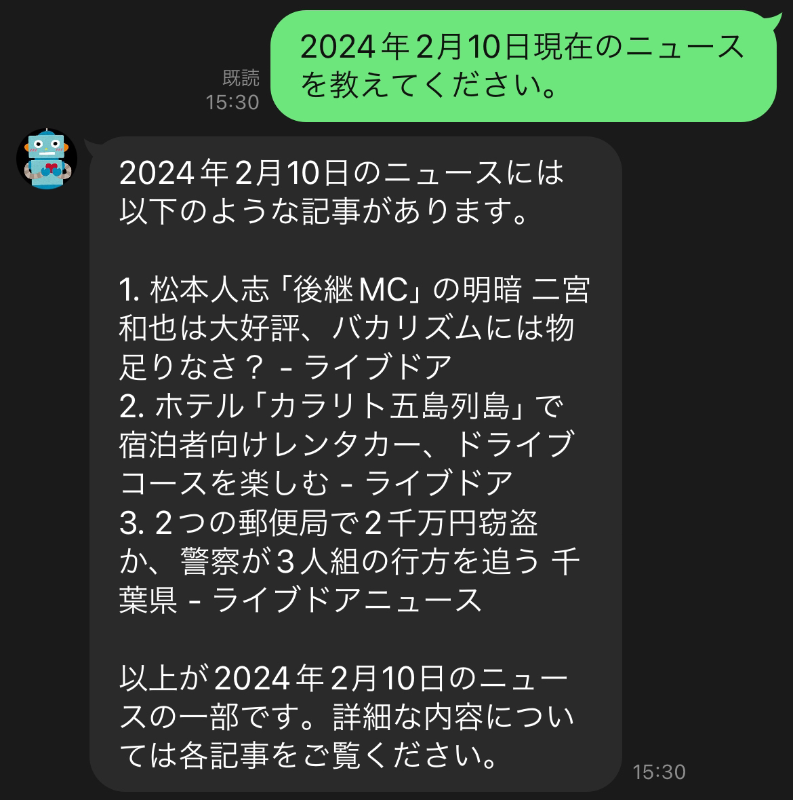

# SmartphoneGuideBot

## 概要
Redmi 12というスマートフォンの使い方およびその他有用な情報をガイドするLINEボット。

## 目的
今までデジタルに全く触れてこなかった祖母がスマホを持ち始めるため、
スマートフォンの使い方がわからなくなった時に気軽にLINEで質問できるボットが必要になると考えた。

## 開発の流れ
GPT-2をQ&Aデータによって一からファインチューニングすることは困難かつ性能も見込めないと考えたため、
ChatGPTのAPIを用いてチャットボットを作成した。  

また、iPhoneやGoogle Pixelなどといったメジャーなスマートフォンであれば、
ChatGPTの学習データセットの中に使い方が記載されている文章があるはずなので、そのまま使えば問題はない。

しかし、祖母が持つのはRedmi 12というマイナーなスマートフォンであるため、
使い方を聞いても一般的なAndroidに共通した内容しか答えることができず、間違った方法を教えてしまった。  

ChatGPTが出力した文章：  


実際の方法：  


以上の問題から、Redmi 12のガイドをChatGPTに認識させる必要が生じたため、
Retrieval-Augmented Generation（RAG）を利用することにした。

RAGとは、文書を外部知識として与えることでそれを踏まえた回答を生成させる手法である。
具体的には、文章をベクトル化してそれをインデックスとして保存することで、
内部で検索処理を行い、それを元にLLMが回答を生成する。

流れ図：  


※ https://aitc.dentsusoken.com/column/Retrieval-Augmented_Generation を参照  

また、RAGにおけるプロンプトのテンプレートは通常以下のように設定される。

```
COMMON_PROMPT = """
    あなたは親切なアシスタントです。
    {history_section}
    以下に文献の情報を提供します。

    ---------------------
    {{context_str}}
    ---------------------

    この情報を参照して、ユーザーの質問に回答してください。
    
    入力：{{query_str}}

    出力：
    """
"""
```

※ {question}にクエリ、{context}に文書情報が入る    

しかしこの場合、文書にない知識に関する質問をすると、文書に書かれていないため知らないという旨を出力する。

チャットボットの出力：


これだと、Redmi 12の使い方を教えるためだけのbotになってしまい、汎用性に欠けてしまっている。

そこで、プロンプトを以下のように変更した。

```
COMMON_PROMPT = """
    あなたは親切なアシスタントです。
    {history_section}
    以下に文献の情報を提供します。

    ---------------------
    {{context_str}}
    ---------------------

    以下のステップを踏んで、ユーザーの質問に回答してください。
    1. 与えられた文献を参考にして回答できる場合、文献からユーザーへのアドバイスを出力してください。
    2. 文献の情報から正確に回答できない場合は、学習済みのデータから回答を出力してください。
    3. ステップ1,2が不可能な場合は、"unknown"のみを出力してください。
    
    入力：{{query_str}}

    出力：
    """
```

まず、文献にある情報を最優先として回答を生成し、それが不可能である場合はLLMの学習済みデータから回答を生成するように条件を分岐させる。

このようにプロンプトを工夫することで、LLMが学習済みである情報もくまなく利用することができる。

チャットボットの出力：


そして、その二つのステップがどちらも不可能である場合は"unknown"という文言を出力させる。

これは、文献にもなく学習済みデータにもないことから、最新のニュースなどを聞かれたなどの場合に出力されると考えられる。

そこで、ステップ3まで行ってしまった場合は検索処理をかける。

Google検索APIを用いてクエリを検索し、結果から回答を生成させることで、最新のニュースなどにも対応させている。

チャットボットの出力：


## 使用技術
ChatGPT, LangChain, Llama-index, Google Cloud Platform