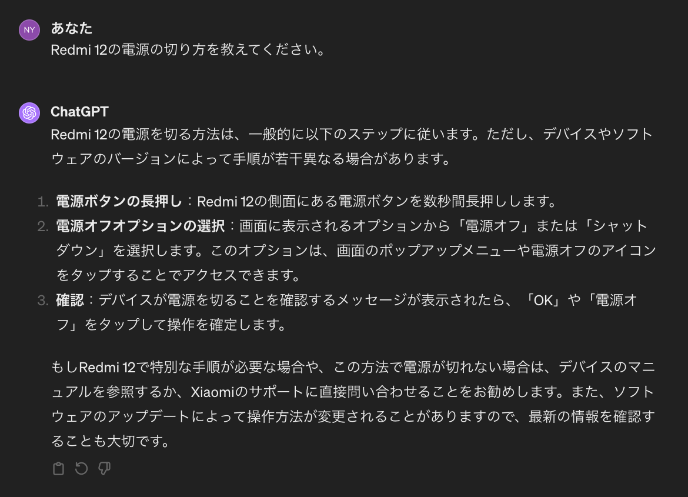
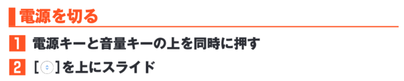
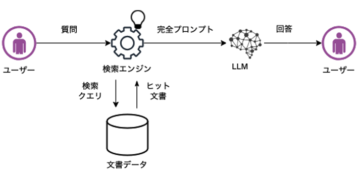

# SmartphoneGuideBot

## 概要
Redmi 12というスマートフォンの使い方およびその他有用な情報をガイドするLINEボット。

## 目的
今までデジタルに全く触れてこなかった祖母がスマホを持ち始めるため、
スマートフォンの使い方がわからなくなった時に気軽にLINEで質問できるボットが必要になると考えた。

## 開発の流れ
GPT-2をQ&Aデータによって一からファインチューニングすることは困難かつ性能も見込めないと考えたため、
ChatGPTのAPIを用いてチャットボットを作成した。  

また、iPhoneやGoogle Pixelなどといったメジャーなスマートフォンであれば、
ChatGPTの学習データセットの中に使い方が記載されている文章があるはずなので、そのまま使えば問題はない。

しかし、祖母が持つのはRedmi 12というマイナーなスマートフォンであるため、
使い方を聞いても一般的なAndroidに共通した内容しか答えることができず、間違った方法を教えてしまった。  

ChatGPTが出力した文章：  


実際の方法：  


以上の問題から、Redmi 12のガイドをChatGPTに認識させる必要が生じたため、
Retrieval-Augmented Generation（RAG）を利用することにした。

RAGとは、文書を外部知識として与えることでそれを踏まえた回答を生成させる手法である。
具体的には、文章をベクトル化してそれをインデックスとして保存することで、
内部で検索処理を行い、それを元にLLMが回答を生成する。

流れ図：  


※ https://aitc.dentsusoken.com/column/Retrieval-Augmented_Generation を参照  

また、RAGにおけるプロンプトのテンプレートは通常以下のように設定される。

```
template ="""
[参考]部分の情報を使って質問に回答してください。
[質問]
{question}
[参考]
{context}
"""
```

※ {question}にクエリ、{context}に文書情報が入る  
※ https://www.ariseanalytics.com/activities/report/20230818-2/ を参照  

しかしこの場合、文書にない知識に関する質問をすると、文書に書かれていないため知らないという旨を出力する。
